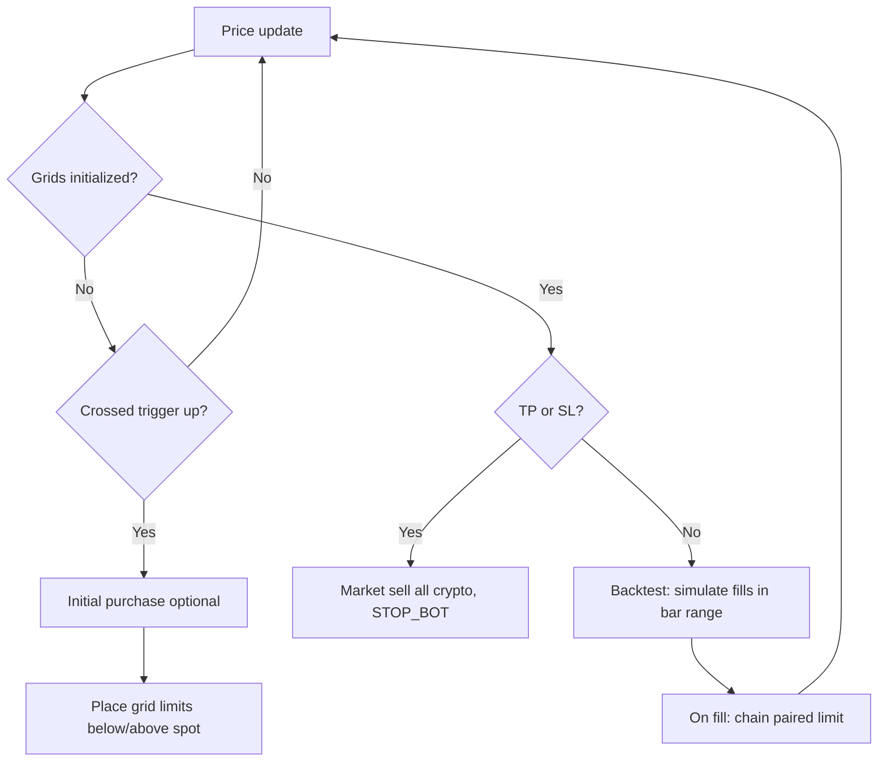

# Grid trading strategy logic

This document describes how the bot’s grid trading strategy behaves in code: grid construction, when trading starts, how orders are sized and placed, and how fills chain into new orders. It reflects `GridTradingStrategy`, `GridManager`, `GridStrategy` implementations, `OrderManager`, and backtest `OrderSimulator`.

## Operating modes

| Mode | Data source | Execution |
|------|-------------|-----------|
| **Backtest** | Historical OHLCV (CSV / configured period) | `OrderSimulator` fills limit orders when bar high/low crosses grid prices; market orders simulated similarly. |
| **Live** | Real-time ticker stream | Exchange execution via configured execution strategy. |
| **Paper** | Real-time ticker (typically simulated exchange) | Same flow as live with paper balances. |

In all modes, the strategy loop updates account metrics, waits for the **trigger price** to be crossed, then (optionally) runs an **initial purchase** and **grid order initialization**. After that it monitors **take-profit** and **stop-loss** on each price update (and simulates intra-bar fills in backtest).

## Grid geometry and trigger

Grid prices are derived from config: **bottom range**, **top range**, **number of grids**, and **spacing type**.

- **Arithmetic**: evenly spaced from bottom to top. **Central price** = average of top and bottom (midpoint of the band).
- **Geometric**: levels follow a constant ratio between adjacent grids. **Central price** is the middle grid (or average of the two middle grids if the count is even).

`GridManager.get_trigger_price()` returns this **central price**. The bot does **not** arm the grid until price **crosses upward** through that level (see [Entry and grid arming](#entry-and-grid-arming)).

## Strategy types

The bot selects behavior via `StrategyType`:

### Simple grid (`SIMPLE_GRID`)

- **Buy grids**: all grid prices **≤** central price. Initial state: `READY_TO_BUY`.
- **Sell grids**: all grid prices **>** central price. Initial state: `READY_TO_SELL`.
- After a **buy fill**, the level becomes `READY_TO_SELL`. After a **sell fill**, it becomes `READY_TO_BUY`.
- **Paired sell** after a buy: the **first** sell level (sorted ascending) that is **above** the buy level’s price and can accept a sell order (`READY_TO_SELL`).

### Hedged grid (`HEDGED_GRID`)

- **Buy grids**: all levels **except the top** price.
- **Sell grids**: all levels **except the bottom** price.
- Most levels start as `READY_TO_BUY_OR_SELL` (can place either side when allowed). The **top** level starts `READY_TO_SELL` only.
- **Paired sell** after a buy: the grid **one step up** in sorted price order (adjacent higher level).
- State transitions on fill are richer: completing a buy can arm a **paired** sell level; completing a sell can arm a **paired** buy level, per `HedgedGridStrategy.complete_order`.

Orders are only placed when `can_place_order` is true for that level and side (state machine differs by strategy type).

## Grid level lifecycle (states)

Each `GridLevel` tracks:

- `READY_TO_BUY`, `READY_TO_SELL`, `READY_TO_BUY_OR_SELL` — eligible to place the corresponding limit(s).
- `WAITING_FOR_BUY_FILL` / `WAITING_FOR_SELL_FILL` — a limit order is open at that price.

Pairing links (`paired_buy_level` / `paired_sell_level`) record which level triggered a reciprocal order for hedged-style chaining.

## Entry and grid arming

Grid orders are initialized **once**, when:

1. There is a **previous** price tick (or bar close in backtest), and  
2. Price **crosses up** through the trigger: `last_price <= trigger_price <= current_price`, **or** `last_price == trigger_price`.

Then:

1. Unless **recovery** skips it (`skip_initial_purchase`), **`perform_initial_purchase`** runs a **market buy** sized to move toward half of the **risk-budgeted** portfolio (in fiat terms) held as crypto (see [Sizing](#sizing)).
2. **`initialize_grid_orders`** places **limit buys** on buy-side grids **below** current price and **limit sells** on sell-side grids **above** current price (levels at or on the wrong side of spot are skipped).

**Recovery mode** can skip the initial purchase and/or treat grids as already initialized so the bot can resume from persisted state.

Event bus notifications: `INITIAL_PURCHASE_DONE`, `GRID_ORDERS_INITIALIZED`.

## Sizing

### Per-grid limit order size

For a given side (buy or sell):

- Take **total portfolio value in fiat** at the current price.
- Multiply by **`max_portfolio_fraction_for_sizing`** (caps how much of the portfolio is used for sizing).
- Divide by **number of grid levels** and by **current price** to get a base crypto amount.
- Multiply by **`buy_ratio`** or **`sell_ratio`** depending on side.

Quantities are then validated/adjusted against balances and exchange rules.

### Initial market purchase

- Portfolio value = fiat + crypto marked at current price.
- Effective budget = that value × `max_portfolio_fraction_for_sizing`.
- Target crypto **notional** = half of that effective budget; buy enough so that **current crypto notional** moves toward that target, capped by available fiat (zero if already at or above target).

## Order placement and fills

### Live / paper

- Limits are submitted through the **order execution strategy**; pending orders are tracked in the **order book** and levels move to “waiting for fill” states.
- When the exchange reports a fill (`ORDER_FILLED`):

  **Buy filled**

  1. `complete_order` updates the buy level’s state (strategy-specific).
  2. Resolve a **paired sell** level (`get_paired_sell_level`).
  3. If valid, place a **sell** limit at the paired level with quantity `filled * sell_ratio`.

  **Sell filled**

  1. `complete_order` updates the sell level’s state.
  2. Resolve **paired buy** (`get_or_create_paired_buy_level` — existing pair or level immediately below).
  3. If valid, place a **buy** limit with quantity `filled * buy_ratio`.

Pairing metadata is updated when placing these follow-on orders. Notifications are sent on placement failures and some successes.

### Backtest

On each bar, `simulate_order_fills(high, low, timestamp)`:

- Collects **open** orders from the order book.
- Computes which **buy grid prices** lie in `[low, high]` and which **sell grid prices** lie in `[low, high]`.
- Any pending limit whose price is in the crossed set for its side is **fully filled** (optional slippage adjusts average price), removed from open orders, and **`ORDER_FILLED`** is published — the same `_on_order_filled` path as live runs.

Initial purchase in backtest: after the market buy is created, **`simulate_fill`** runs outside the order lock so the fill event does not deadlock.

## Take-profit and stop-loss

Evaluated on each tick/bar **after** grids are initialized, and only if **crypto balance > 0**:

- **Take-profit** (if enabled): when `current_price >= take_profit_threshold`, execute a **market sell** for **full** tracked crypto balance.
- **Stop-loss** (if enabled): when `current_price <= stop_loss_threshold`, same **market sell**.

On trigger, the strategy publishes **`STOP_BOT`** with a TP/SL message so the rest of the bot can shut down cleanly.

## Live loop specifics

- Ticker callback runs about every **`TICKER_REFRESH_INTERVAL`** seconds (default 3).
- **Live metrics**: a bounded deque stores `(timestamp, account_value, price)` for reporting (e.g. ~24h at that interval).

## Backtest reporting

- Account value is written per bar into the OHLCV DataFrame for plotting and performance analysis.
- **`generate_performance_report`** uses either backtest `data` or live metrics to build summaries via `TradingPerformanceAnalyzer`.

## Summary flow

This is **not** financial advice; it is a technical description of the implementation’s control flow and rules.
